# Faahtree

## What is Faahtree?

Faahtree is a mythical wisdom tree. [Faahtree](https://faahtree.com) the app is a real world RPG where you give yourself quests and gain XP. First you create a quest for yourself (any kind of task or activity) by entering in some information about the quest, and then it gets added to your quest list. 

When you complete quests you gain experience in different areas, such as strength or intelligence, based on the different aspects of the quest. You can view some basic stats and charts about where your strengths and weaknesses are, and how much XP you've gained over time.

Since this is mainly an app to use on the go it's optimized for mobile, however it also works fine on any computer.

## Where to check it out

Faahtree can be found at [https://faahtree.com](https://faahtree.com) or [https://faahtree.firebaseapp.com](https://faahtree.firebaseapp.com).

## Motivation

I was working on updating some of our React apps at work and I wanted some more practice with React since I mainly do back end work. I had been on a [LitRPG](https://en.wikipedia.org/wiki/LitRPG) reading binge in my free time and thought it would be cool to have a basic app to mimic an RPG game in real life. With that as motivation I decided to make a React/Redux app to do just that. I also wanted to play around with some tech I had never used so I also decided to use Firebase to host and the NoSQL Firestore as storage. 

## Screenshots

### Register and Sign In

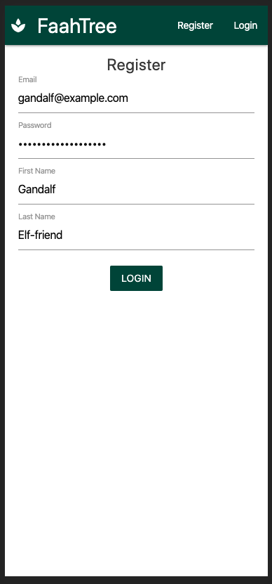
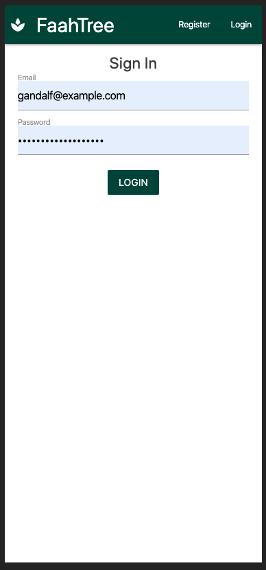

### Main status page - new and with quests

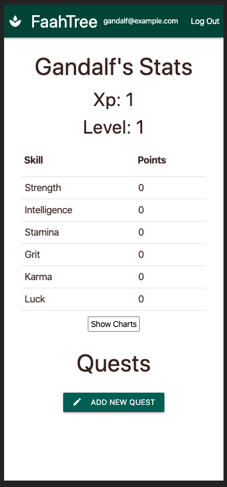
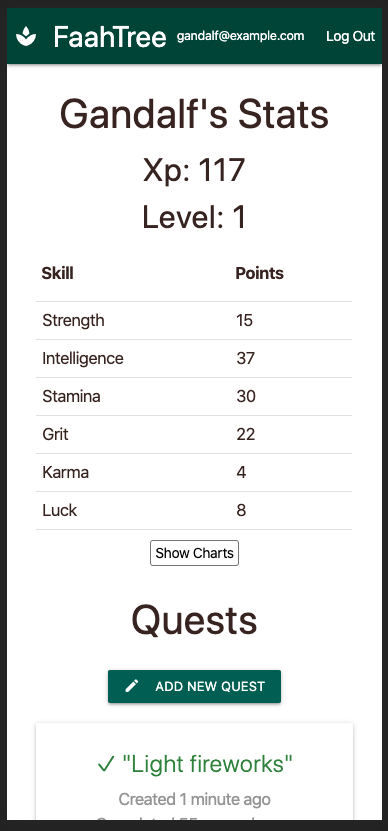
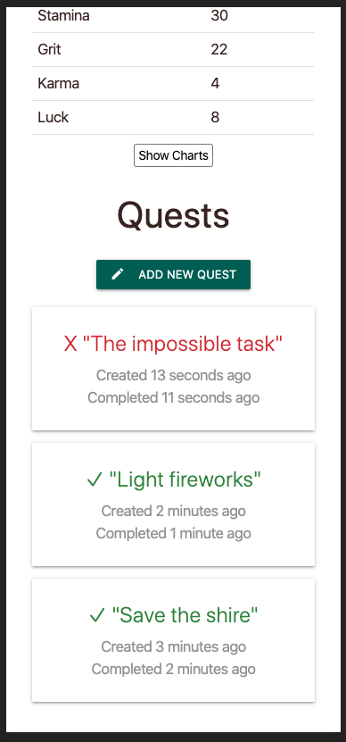

### Creating quests

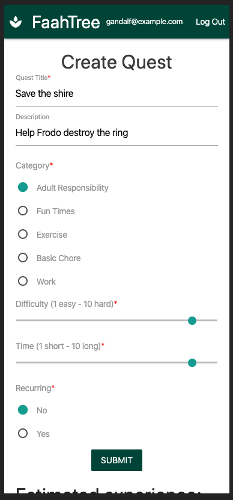

### Quest detail and finishing quests

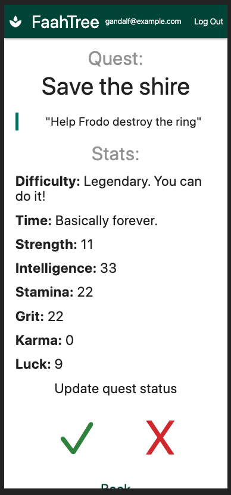
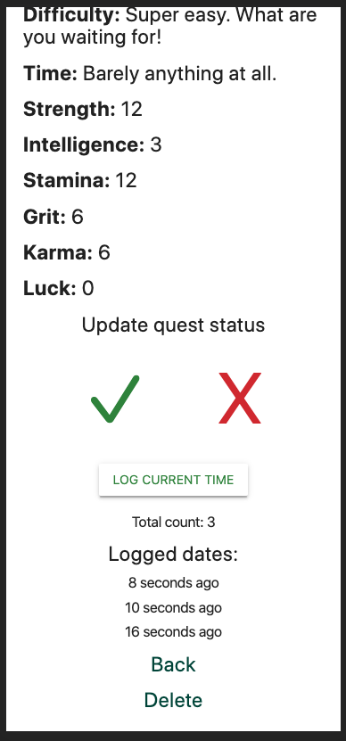
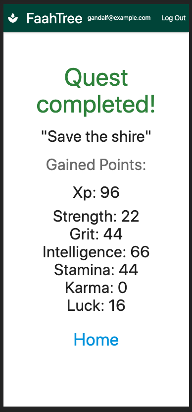
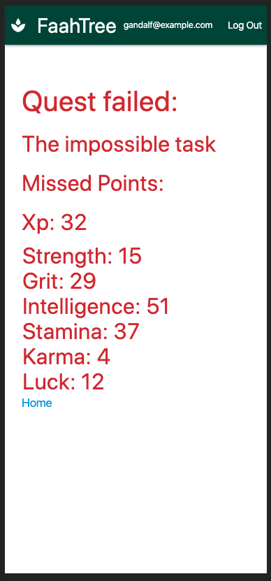

### Charts

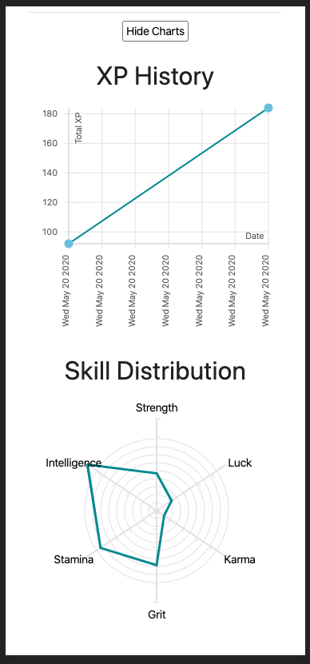

## Tech

* [React](https://reactjs.org/)
* [Redux](https://react-redux.js.org/)
* [Firebase](https://firebase.google.com/)
* [Firestore](https://firebase.google.com/docs/firestore)
* [Materialize](https://materializecss.com/)
* [Jest](https://jestjs.io/)

## Code examples

### Example of how an 'exercise' quest calculates points

```javascript
    var time = task.time;
    var diff = task.difficulty;

    ...

    case 'exercise':
        multiplier = 2 + Math.floor(Math.sqrt(time * diff));
        strength = 4 * multiplier;
        intelligence = 1 * multiplier;
        stamina = 4 * multiplier;
        grit = 2 * multiplier;
        karma = 2 * multiplier;
        luck = Math.floor(Math.random() * multiplier);
        break;

    ...

    var xp = strength + intelligence + stamina + grit + karma + luck;

    var stats = {
        strength: strength,
        intelligence: intelligence,
        stamina: stamina,
        grit: grit,
        karma: karma,
        luck: luck,
        xp: xp
    }
```

### Example return of the quest list component

```javascript
    return (
        <div className="brown-text text-darken-4">
            <h3 className="center">Quests</h3>
            <Link to={'/quests/create'}>
                <div className="center-align">
                    <p className="waves-effect waves-light btn-small teal darken-3">
                        <i className="material-icons left">create</i>Add New Quest
                    </p>
                </div>
            </Link>
            {sortedTasks.map((task, i) => {
                return (
                    <Link to={'/quests/' + task.id} key={i}>
                        <TaskDetails task={task} key={i} />
                    </Link>
                )
            })}
        </div>
    )
```

### Example of createTask action

```javascript
    export const createTask = (task) => {
        return (dispatch, getState, { getFirebase, getFirestore }) => {
            const firestore = getFirestore();
            const authorId = getState().firebase.auth.uid;
            firestore.collection('tasks').add({
                ...task,
                authorId: authorId,
                createdAt: new Date(),
                updatedAt: ""
            }).then(() => {
                dispatch({ type: 'CREATE_TASK', task });
            }).catch((err) => {
                dispatch({ type: 'CREATE_TASK_ERROR', err})
            })
        }
    }
```

## Getting started

First clone the repo in your favorite directory `git clone https://github.com/jpclark6/reactrpg.git`.

Next install dependencies using `npm install`.

Next update the firebase config with your credentials under `src/config/fbConfig.js`.

Start it up using `npm start`.

## Testing

Some basic tests have been added for this app that can be run using `npm test`. 

Overall the testing isn't great. While I believe in strong testing overall, building this was a huge learning experience for using React/Redux/Firebase, and testing wasn't a focus. Which brings me to my next section...

## To-do/wishlist

The app works. However, it's not super fun and entertaining... yet. Here's my to-do/wishlist to improve the full experience.

* Gain skill badges based on points in different categories. Ex. gain 30 points in Strength and get 'Gimli Strength' badge. Additionally allow people to enter their own badge titles.

* Fix chart axes initially, but just replace the charts package with something better. I used [react-vis](https://uber.github.io/react-vis/) however its documenation is lacking and I ended up not being very satisfied with the results, but I don't feel like digging through source code to fix it when I'm sure better things out there exist.

* Add in cash rewards. Combine with something like Stripe to allow users to attach real rewards to finishing tasks.

* Share quests with other users, such as a "Coffee date" quest.

* Test! Add in extensive testing

* Rip out Materialize and use custom CSS. Some JS libraries could be used for basic animations but Materialize worked well for the basics but became a burdon once I tried making things more custom. Make the UI/UX better. It looks a bit like like ameteur hour.

## Thanks for checking it out